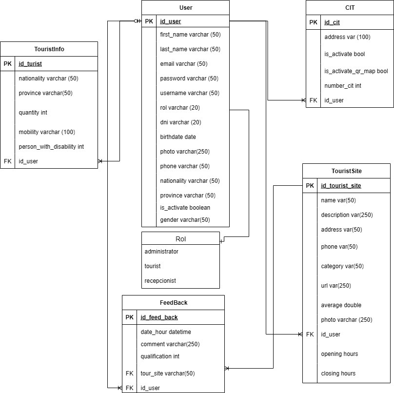

**GoTour: Innovating the Traveler Experience in Maipú** 

_Members:_

📌Ledesma Ruben  
📌Puebla Santiago  
📌Espinosa Rodrigo  
📌Romano Santiago

_Introduction:_

In Maipú, Mendoza, tourists face challenges such as a lack of digital information, poor signage, and difficulties planning routes or finding safe areas. This can lead to disorientation and wasted time.

GoTour solves this by using QR codes 📲 in Tourist Information Centers, giving access to an interactive digital map showing wineries 🍷, restaurants, museums, accommodations, cultural activities, reviews, opening hours, and transport options.

GoTour enhances the tourist experience by saving time, improving safety 🛡️, and helping plan personalized routes.

_Initial Entities:_

📌CIT  
📌FEEDBACK  
📌TOURIST_SITES  
📌TOURIST_INFO  
📌USER(ADMIN,RECEPCIONIST,TOURIST)

▶️ **Instructions to Run the Project**
1. _Clone the repository:_

`git clone https://github.com/tu-usuario/tu-repo.git`

2. _Create a virtual environment:_

  On Windows:

`python -m venv <environment_name>`

  On Linux/macOS:

`python3 -m venv <environment_name>`

3. _Activate the virtual environment:_

  On Windows:

`<environment_name>\Scripts\activate`

  On Linux / macOS:

`source <environment_name>/bin/activate`

4. _Install dependencies:_

On Windows, Linux, and macOS:

`pip install -r requirements.txt`

5. _Run database migrations (Flask-Migrate):_

Initialize migrations folder (only first time):

`flask db init`

Generate a new migration after model changes:

`flask db migrate -m "Initial migration"`

Apply migrations to the database:

`flask db upgrade`

🔹 Note: Make sure your FLASK_APP environment variable is set, for example:

export FLASK_APP=app.py        # Linux/macOS  
set FLASK_APP=app.py           # Windows CMD  
$env:FLASK_APP="app.py"        # PowerShell  

4. _Run the application:_

`python3 -m venv <nombre_del_entorno` 

📜 **Class Diagram**

🛠️ **Technologies and Tools Used**

_Python_ 🐍

_Flask_ 🔥

_MySQL_ 🐬

_MySQL Workbench_ 🧰

_Git & GitHub_ 🔧

_HTML_ 🌐

_CSS_ 🎨

_Jinja2_ ⛩️

_Bootstrap_ 💻

_JavaScript_ ⚡️

🔗 **API Documentation**

Check out the full API documentation on Postman:

[View API Documentation (Postman)](https://documenter.getpostman.com/view/31369461/2sB3QGsAZG)

